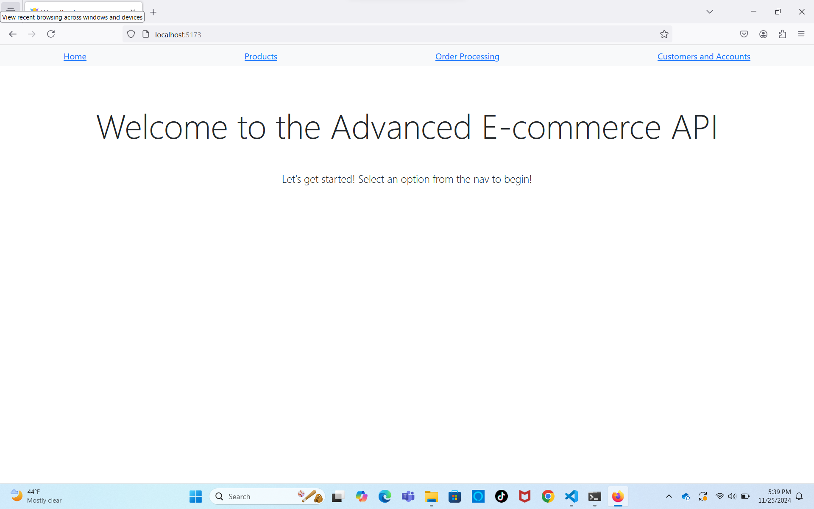
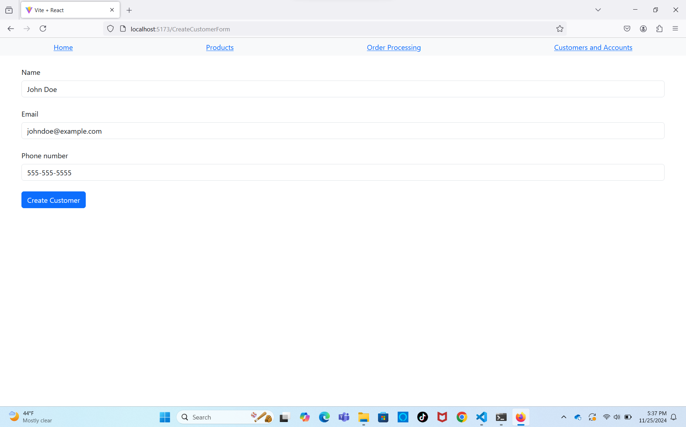
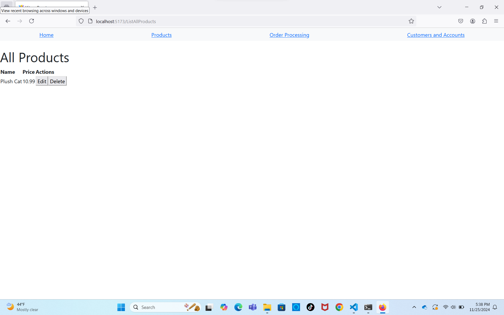

# Mini-Project: Advanced E-commerce API

- Author: Jaycob Hoffman

- Date: 24 November 2024

## Documentation

"Mini-Project: Advanced E-commerce API" is a full-stack program that simulates users' abilities to create and manage customers and their accounts, add and manage products, as well as place and track orders on an e-commerce web application.

### User Interaction and Main Features

Users can interact with the API through an intuitive UI built in React.

- **Customer Management**: Users can easily add and update customers by entering the name, email address, and phone number of the customer they wish to add into the "Create Customer" form. Users can also view a list of all customers on the "View Customers" page, with the option of editing or deleting each one.
- **Product Management**: Users can add and update products by entering the name and price of the product they wish to add into the "Create Product" form. As with customers, users can view a list of all products on the "View Products" page, with the option of editing or deleting each.
- **Order Management**: Finally, users can place orders and view order details. They can enter the name of the product they wish to order, as well as the name of the customer "ordering" the product.

### Examples of program's functionalities:

- E-commerce API homepage:



- Creating account for "John Doe":



- Listing all available products:



### Errors

The E-commerce API will raise errors with accompanying messages under the following circumstances:

- ```Validation Error```: If the user enters invalid data into a form (e.g., entering a letter into the "phone number" field when adding a customer)
- ```404 Not Found Error```: If the user enters route in their browser's address bar that does not exist in the program.

#

View the Advanced E-commerce API [GitHub Repository](https://github.com/JaycobHoffman1/mini-project-advanced-e-commerce-api)